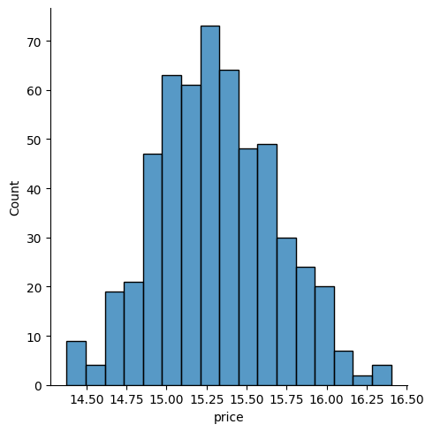

# House Price Prediction

## Overview
This project involves building a machine learning model to predict house prices based on various features such as location, number of bedrooms, and other property attributes. The model is trained on a dataset containing historical data of house prices and is designed to provide accurate predictions for new, unseen properties.

## Project Structure

- **Dataset**: The dataset used in this project is a CSV file containing the following features:
price,area,bedrooms,bathrooms,stories,mainroad,guestroom,basement,hotwaterheating,airconditioning,parking,prefarea,furnishingstatus

## Vizualisations

